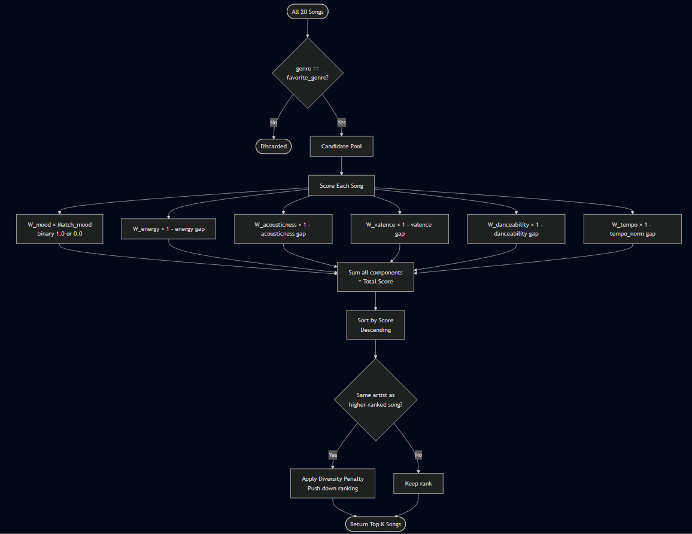
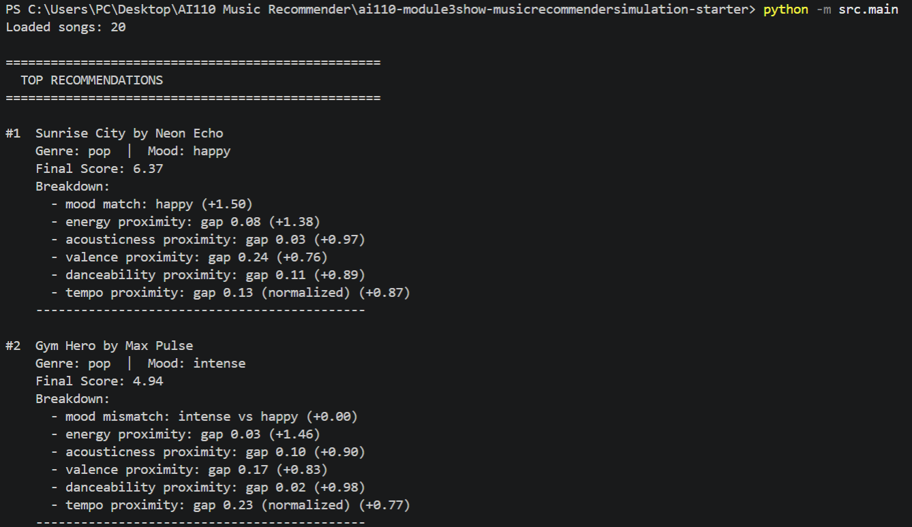
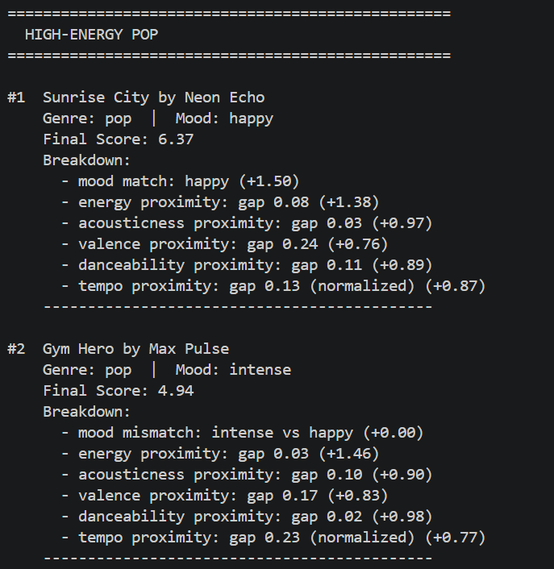
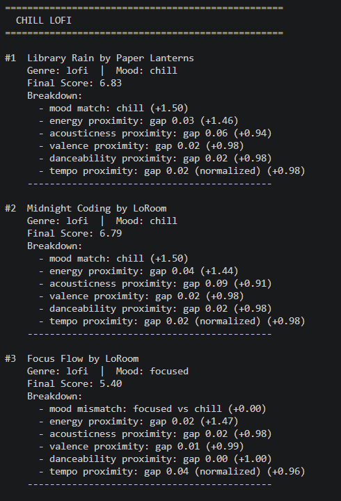
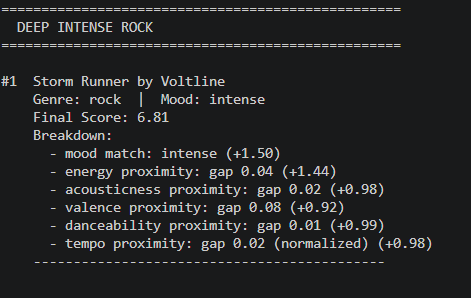

# 🎵 Music Recommender Simulation

## Project Summary

In this project you will build and explain a small music recommender system.

Your goal is to:

- Represent songs and a user "taste profile" as data
- Design a scoring rule that turns that data into recommendations
- Evaluate what your system gets right and wrong
- Reflect on how this mirrors real world AI recommenders

Replace this paragraph with your own summary of what your version does.

---

## How The System Works

How real-world recommendations work:
Music platforms such as Spotify, Apple Music, YouTube, have algorithms for music recommendations that use both the Social Approach: Collaborative Filtering, and the Audio Approach: Content-Based Filtering. 

Collaborative filtering relies solely on user behavior and the wisdom of the crowd. It operates on the premise that if User A and User B have similar listening data, User A will likely enjoy the songs that User B has played.

Content-based filtering analyzes the actual audio and metadata of the songs. Platforms extract hundreds of audio features by mapping out the BPM, key, time signature, "danceability," acousticness, and energy levels. It then mathematically matches the profile of songs to the songs the user has listened to.

Explain your design in plain language.

Some prompts to answer:

- What features does each `Song` use in your system
  - For example: genre, mood, energy, tempo

  Currently, we will use these features of the song to "Score" and "Rank" our songs:
  artist name, genre, mood, energy, tempo_bpm, valence, danceability, and acousticness. 
  
  Because the top 10 songs by score might all be by the exact same artist, or from the exact same album, we need a system to balance these out. We can do this by penalizing songs that are by the same artist(s) and lower their ranking.

- What information does your `UserProfile` store
 In our UserProfile dataclass thats in recommender.py, we store the user's music preferences:
 favorite_genre, favorite_mood, target_energy, likes_acoustic. THe recommender class then uses these preferences to score and rank new songs.
- How does your `Recommender` compute a score for each song
The recommender will compare each song's attributes with the ones in UserProfile, then assign a score. We use a weighted proximity formula to score each song. It will first filter the catalog to only songs that match the user's preferred genre. It then makes two comparisons: category match (genre and mood), scores 1.0 if the song's value matches the user's preference, 0 if not. Each then multiplied by its assigned weight. 

The energy, acousticness, valence, danceability, tempo features use this formula:
Weight × (1 − |user_target − song_value|).
This rewards songs that are close th the user's target value on a scale, rather than favoring high or low values. Tempo will be normalized from BPM to a 0.1 to fit this formula. This weay, all components are summed into a single score for each song while being more precise.

- How do you choose which songs to recommend
After scoring, songs are sorted from highest to lowest score. Before returning the top results, a diversity pass is applied: if multiple high-scoring songs share the same artist, later songs by that artist are penalized and pushed down the ranking. This prevents the top recommendations from being dominated by a single artist. The final top k songs after this reranking are returned as the recommendations.

## The specific features your Song and UserProfile objects will use
Song Object Features

| Field          | Type    | Role in Scoring                                       |
|----------------|---------|-------------------------------------------------------|
| `id`           | `int`   | Identifier only, not scored                           |
| `title`        | `str`   | Display only, not scored                              |
| `artist`       | `str`   | Used in diversity penalty phase                       |
| `genre`        | `str`   | Hard filter before scoring                            |
| `mood`         | `str`   | Categorical match (weighted binary)                   |
| `energy`       | `float` | Continuous proximity score                            |
| `tempo_bpm`    | `float` | Continuous proximity score (normalized to 0–1 first)  |
| `valence`      | `float` | Continuous proximity score                            |
| `danceability` | `float` | Continuous proximity score                            |
| `acousticness` | `float` | Continuous proximity score                            |

UserProfile Object Features

| Field                 | Type    | Role                                       |
|-----------------------|---------|--------------------------------------------|
| `favorite_genre`      | `str`   | Drives the hard filter                     |
| `favorite_mood`       | `str`   | Categorical match target                   |
| `target_energy`       | `float` | Proximity target for `song.energy`         |
| `target_acousticness` | `float` | Proximity target for `song.acousticness`   |
| `target_valence`      | `float` | Proximity target for `song.valence`        |
| `target_danceability` | `float` | Proximity target for `song.danceability`   |
| `target_tempo_bpm`    | `float` | Proximity target for `song.tempo_bpm`      |


## Algorithm Recipe:




## CLI Verification:

---


## Sample Outputs

### High-Energy Pop


### Chill Lofi


### Deep Intense Rock


---

## Edge Case Tests


### Edge Case 1


### Edge Case 2


### Edge Case 3


### Edge Case 4


### Edge Case 5


## Getting Started

### Setup

1. Create a virtual environment (optional but recommended):

   ```bash
   python -m venv .venv
   source .venv/bin/activate      # Mac or Linux
   .venv\Scripts\activate         # Windows

2. Install dependencies

```bash
pip install -r requirements.txt
```

3. Run the app:

```bash
python -m src.main
```

### Running Tests

Run the starter tests with:

```bash
pytest
```

You can add more tests in `tests/test_recommender.py`.

---

## Experiments You Tried

Use this section to document the experiments you ran. For example:

- What happened when you changed the weight on genre from 2.0 to 0.5
- What happened when you added tempo or valence to the score
- How did your system behave for different types of users

---

## Limitations and Risks

Summarize some limitations of your recommender.

Examples:

- It only works on a tiny catalog
- It does not understand lyrics or language
- It might over favor one genre or mood

You will go deeper on this in your model card.

---

## Reflection

Read and complete `model_card.md`:

[**Model Card**](model_card.md)

Write 1 to 2 paragraphs here about what you learned:

- about how recommenders turn data into predictions
- about where bias or unfairness could show up in systems like this


---

## 7. `model_card_template.md`

Combines reflection and model card framing from the Module 3 guidance. :contentReference[oaicite:2]{index=2}  

```markdown
# 🎧 Model Card - Music Recommender Simulation

## 1. Model Name

Give your recommender a name, for example:

> VibeFinder 1.0

---

## 2. Intended Use

- What is this system trying to do
- Who is it for

Example:

> This model suggests 3 to 5 songs from a small catalog based on a user's preferred genre, mood, and energy level. It is for classroom exploration only, not for real users.

---

## 3. How It Works (Short Explanation)

Describe your scoring logic in plain language.

- What features of each song does it consider
- What information about the user does it use
- How does it turn those into a number

Try to avoid code in this section, treat it like an explanation to a non programmer.

---

## 4. Data

Describe your dataset.

- How many songs are in `data/songs.csv`
- Did you add or remove any songs
- What kinds of genres or moods are represented
- Whose taste does this data mostly reflect

---

## 5. Strengths

Where does your recommender work well

You can think about:
- Situations where the top results "felt right"
- Particular user profiles it served well
- Simplicity or transparency benefits

---

## 6. Limitations and Bias

Where does your recommender struggle

Some prompts:
- Does it ignore some genres or moods
- Does it treat all users as if they have the same taste shape
- Is it biased toward high energy or one genre by default
- How could this be unfair if used in a real product

---

## 7. Evaluation

How did you check your system

Examples:
- You tried multiple user profiles and wrote down whether the results matched your expectations
- You compared your simulation to what a real app like Spotify or YouTube tends to recommend
- You wrote tests for your scoring logic

You do not need a numeric metric, but if you used one, explain what it measures.

---

## 8. Future Work

If you had more time, how would you improve this recommender

Examples:

- Add support for multiple users and "group vibe" recommendations
- Balance diversity of songs instead of always picking the closest match
- Use more features, like tempo ranges or lyric themes

---

## 9. Personal Reflection

A few sentences about what you learned:

- What surprised you about how your system behaved
- How did building this change how you think about real music recommenders
- Where do you think human judgment still matters, even if the model seems "smart"

